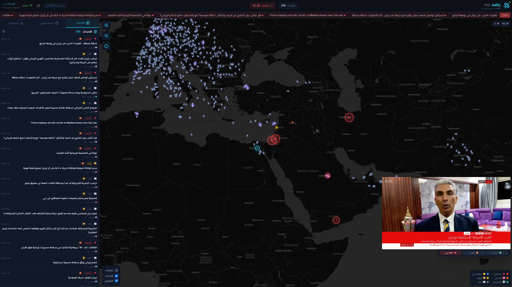
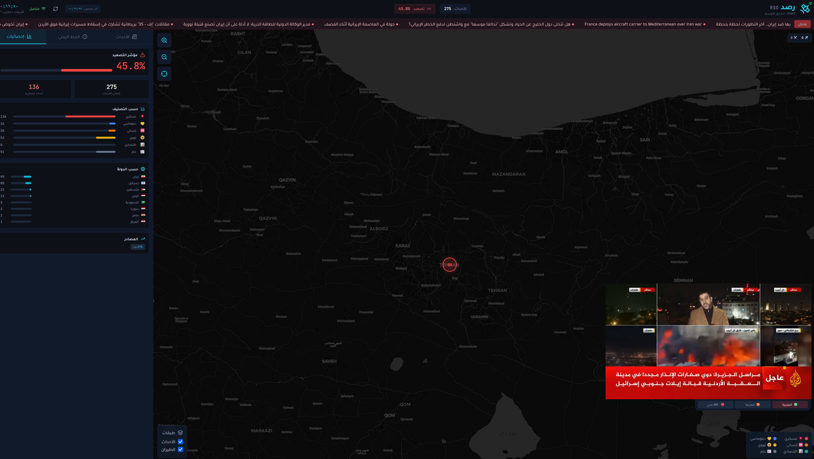

<div align="center">

# 🛰️ رصد (Rsd) v1.0

### منصة استخبارات المصادر المفتوحة للشرق الأوسط
**Open Source Intelligence (OSINT) Dashboard for the Middle East**


<br>


</div>

---

## 📋 نظرة عامة | Overview

**رصد** هي لوحة تحكم شخصية لرصد الأحداث العسكرية والأمنية والجيوسياسية في الشرق الأوسط لحظياً. تجمع البيانات من مصادر متعددة وتعرضها على خريطة تفاعلية مع تصنيف ذكي.

**Rsd** is a personal OSINT dashboard for real-time monitoring of military, security, and geopolitical events across the Middle East. It aggregates data from multiple sources and displays them on an interactive map with intelligent classification.

---

---

## 📸 لقطات الشاشة | Screenshots

<div align="center">

| الواجهة الرئيسية | الخريطة والأحداث |
|:---:|:---:|
|  |  |

</div>

---

## ✨ الميزات | Features

| الميزة | الوصف |
|--------|-------|
| 🗺️ **خريطة تفاعلية** | عرض الأحداث على خريطة Leaflet مع تجميع ذكي للعلامات وتصنيف بالألوان |
| 📰 **شريط أخبار عاجلة** | تدفق مباشر للأخبار مع فلاتر حسب التصنيف والخطورة والدولة |
| ✈️ **تتبع الطيران** | رصد الطائرات فوق المنطقة عبر ADS-B مع تمييز الطيران العسكري |
| ⏳ **خط زمني** | عرض الأحداث زمنياً مع إمكانية التصفية |
| 📊 **إحصائيات** | مؤشر التصعيد، توزيع حسب الدولة والتصنيف والمصدر |
| 📺 **البث المباشر** | مشغل مدمج للقنوات الإخبارية (الجزيرة، العربية، BBC) |
| 🔄 **تحديث تلقائي** | جلب الأخبار تلقائياً مع مؤشر "آخر فحص" |

---

## 🏷️ التصنيفات | Categories

| التصنيف | الأيقونة | الوصف |
|---------|----------|-------|
| عسكري | 💥 | هجمات، غارات، عمليات عسكرية |
| دبلوماسي | 🤝 | مفاوضات، هدنات، قمم |
| إنساني | 🆘 | أزمات، لاجئين، مساعدات |
| نووي | ☣️ | تخصيب، وكالة الطاقة الذرية |
| اقتصادي | 📊 | عقوبات، نفط، تجارة |
| عام | 📰 | أخبار عامة |

---

## 📡 مصادر البيانات | Data Sources

| المصدر | الوصف | التحديث |
|--------|-------|---------|
| **GDELT** | أحداث عالمية من تحليل الأخبار | كل 15 دقيقة |
| **NewsAPI** | أخبار من مصادر عالمية متعددة | كل 10 دقائق |
| **RSS Feeds** | خلاصات عربية ودولية (25+ مصدر) | كل دقيقتين |
| **Google Alerts** | تنبيهات مخصصة للمنطقة | كل دقيقتين |
| **UCDP** | بيانات النزاعات المسلحة (جامعة أوبسالا) | يومياً |
| **ADS-B** | تتبع الطيران (adsb.lol) | كل 30 ثانية |

### 📰 مصادر RSS المدعومة

<details>
<summary>اضغط للعرض</summary>

**أخبار عربية:**
- الجزيرة (عربي + English)
- العربية
- BBC Arabic / Middle East
- France24 Arabic
- Sky News Arabia
- RT Arabic

**تحليلات دولية:**
- Al-Monitor
- Defense One
- War on the Rocks
- The Drive - War Zone
- Breaking Defense

**أخبار نووية:**
- World Nuclear News
- IAEA News
- Arms Control Association

**تنبيهات Google Alerts:**
- Middle East Airstrikes
- Gaza Yemen Syria
- Houthi / حوثي
- Red Sea
- Iran Nuclear / تخصيب يورانيوم
- Ceasefire / هدنة
- Humanitarian Crisis

</details>

---

## 🚀 التشغيل | Getting Started

### المتطلبات | Requirements

- **Python** 3.10+
- **Node.js** 18+
- **مفتاح NewsAPI** (اختياري) - [احصل على مفتاح مجاني](https://newsapi.org/)

### الطريقة 1: تشغيل سريع (Windows)

```batch
# انقر مرتين على:
start-rasad.bat
```

سيقوم السكربت بـ:
1. ✅ فحص Python و Node.js
2. ✅ تثبيت المكتبات تلقائياً
3. ✅ تشغيل Backend و Frontend
4. ✅ فتح المتصفح على http://localhost:3000

### الطريقة 2: Docker Compose

```bash
# 1. أنشئ ملف .env
cp .env.example .env
nano .env  # أضف NEWSAPI_KEY=xxxxx

# 2. شغّل
docker-compose up -d

# 3. افتح المتصفح
# الواجهة: http://localhost:3000
# API Docs: http://localhost:8000/docs
```

### الطريقة 3: تشغيل يدوي

```bash
# Backend
cd backend
pip install -r requirements.txt
uvicorn app.main:app --reload --port 8000

# Frontend (terminal جديد)
cd frontend
npm install
npm run dev
```

---

## 📁 هيكل المشروع | Project Structure

```
rasad/
├── 📂 backend/
│   ├── 📂 app/
│   │   ├── 📄 main.py              # نقطة الدخول + API endpoints
│   │   ├── 📄 config.py            # الإعدادات (.env)
│   │   ├── 📄 scheduler.py         # جدولة جمع البيانات
│   │   ├── 📂 collectors/          # جامعات البيانات
│   │   │   ├── gdelt.py            # GDELT Project
│   │   │   ├── news_api.py         # NewsAPI
│   │   │   ├── rss_feeds.py        # RSS + Google Alerts
│   │   │   ├── ucdp.py             # UCDP Uppsala
│   │   │   └── adsb.py             # ADS-B تتبع الطيران
│   │   ├── 📂 api/
│   │   │   ├── events.py           # API الأحداث
│   │   │   └── flights.py          # API الطيران
│   │   └── 📂 models/
│   │       └── database.py         # SQLite + SQLAlchemy
│   └── 📄 requirements.txt
│
├── 📂 frontend/
│   ├── 📂 src/
│   │   ├── 📄 App.jsx              # التطبيق الرئيسي
│   │   ├── 📂 components/
│   │   │   ├── 📂 Layout/
│   │   │   │   ├── Header.jsx      # الشريط العلوي
│   │   │   │   └── LiveTVDrawer.jsx # البث المباشر
│   │   │   ├── 📂 Map/
│   │   │   │   └── RasadMap.jsx    # خريطة Leaflet
│   │   │   ├── 📂 NewsFeed/
│   │   │   │   └── NewsFeed.jsx    # قائمة الأخبار
│   │   │   ├── 📂 Timeline/
│   │   │   │   └── Timeline.jsx    # الخط الزمني
│   │   │   └── 📂 Stats/
│   │   │       └── StatsPanel.jsx  # الإحصائيات
│   │   ├── 📂 hooks/
│   │   │   └── usePolling.js       # خطاف التحديث التلقائي
│   │   └── 📂 utils/
│   │       ├── api.js              # دوال API
│   │       └── constants.js        # ثوابت ومساعدات
│   └── 📄 package.json
│
├── 📂 data/                         # قاعدة البيانات (SQLite)
├── 📄 docker-compose.yml
├── 📄 start-rasad.bat               # تشغيل سريع Windows
├── 📄 stop-rasad.bat                # إيقاف Windows
├── 📄 .env                          # المتغيرات (أنشئه من .env.example)
└── 📄 README.md
```

---

## ⚙️ API Endpoints

### الأحداث | Events

| المسار | الوصف |
|--------|-------|
| `GET /api/events/` | الأحداث مع فلاتر (category, severity, country_code, hours, limit) |
| `GET /api/events/latest` | أحدث 20 حدث |
| `GET /api/events/map` | أحداث الخريطة (فقط التي لها إحداثيات) |
| `GET /api/events/stats` | إحصائيات شاملة |
| `GET /api/events/timeline` | بيانات الخط الزمني |

### الطيران | Flights

| المسار | الوصف |
|--------|-------|
| `GET /api/flights/live` | الرحلات الحية الآن |
| `GET /api/flights/military/history` | سجل الطيران العسكري |
| `GET /api/flights/military/stats` | إحصائيات الطيران |

### النظام | System

| المسار | الوصف |
|--------|-------|
| `GET /api/health` | فحص صحة النظام |
| `GET /api/sources` | المصادر المتاحة |
| `GET /api/collectors/status` | حالة جامعي البيانات |
| `POST /api/refresh` | تحديث يدوي من جميع المصادر |

---

## 🔧 الإعدادات | Configuration

أنشئ ملف `.env` في المجلد الرئيسي:

```env
# مفاتيح API (اختيارية)
NEWSAPI_KEY=your_newsapi_key_here

# قاعدة البيانات
DATABASE_URL=sqlite+aiosqlite:///./data/rasad.db

# فترات التحديث (بالثواني)
GDELT_INTERVAL=900        # 15 دقيقة
NEWSAPI_INTERVAL=600      # 10 دقائق
RSS_INTERVAL=120          # دقيقتين
UCDP_INTERVAL=86400       # يوم
ADSB_INTERVAL=30          # 30 ثانية

# الخادم
BACKEND_HOST=0.0.0.0
BACKEND_PORT=8000
```

---

## 🛠️ التقنيات | Tech Stack

### Backend
| التقنية | الاستخدام |
|---------|----------|
| FastAPI | إطار العمل الرئيسي |
| SQLAlchemy | ORM + قاعدة البيانات |
| aiosqlite | SQLite غير متزامن |
| APScheduler | جدولة المهام |
| httpx | طلبات HTTP غير متزامنة |
| feedparser | تحليل RSS |

### Frontend
| التقنية | الاستخدام |
|---------|----------|
| React 18 | واجهة المستخدم |
| Vite | أداة البناء |
| Tailwind CSS | التنسيق |
| Leaflet | الخريطة التفاعلية |
| Recharts | الرسوم البيانية |
| Lucide React | الأيقونات |

---

## 🔮 المرحلة الثانية | Phase 2 (Planned)

- [ ] 🤖 **Ollama/Qwen AI** - تصنيف ذكي للأخبار بالذكاء الاصطناعي
- [ ] 📱 **Telegram** - رصد قنوات تيليجرام
- [ ] 🧠 **تحليل المشاعر** - للأخبار العربية
- [ ] 🔔 **تنبيهات ذكية** - إشعارات للأحداث المهمة
- [ ] 📄 **تقارير PDF** - تقارير تلقائية
- [ ] 🌐 **Twitter/X** - رصد التغريدات

---

## 🐛 استكشاف الأخطاء | Troubleshooting

### لا تظهر أخبار جديدة
1. تأكد من تشغيل Backend: `curl http://localhost:8000/api/health`
2. افحص حالة الجامعات: `curl http://localhost:8000/api/collectors/status`
3. جرب التحديث اليدوي: اضغط زر 🔄 في الواجهة

### خطأ في NewsAPI
- تأكد من وجود `NEWSAPI_KEY` في `.env`
- المفتاح المجاني يعطي أخبار قديمة فقط (24+ ساعة)

### الخريطة لا تعمل
- تأكد من اتصال الإنترنت (Leaflet يحتاج tiles من OpenStreetMap)
- افحص Console في المتصفح للأخطاء

---

## 📝 الترخيص | License

هذا المشروع للاستخدام الشخصي والتعليمي.

---

<div align="center">

**رصد** 🛰️ - صُنع بـ ❤️ للمعرفة والتوثيق

**Rsd** - Made with ❤️ for Knowledge and Documentation

---

المطور | Developer: **عبدالكريم العبود**

📧 abo.saleh.g@gmail.com

</div>
