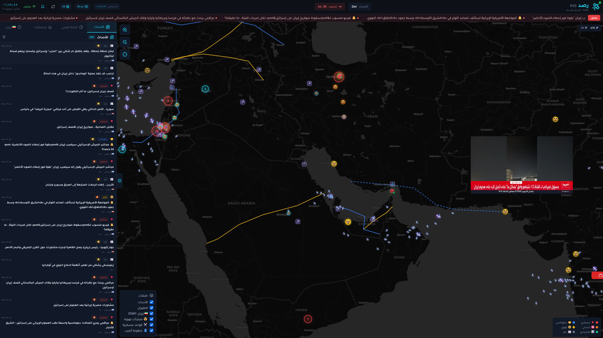
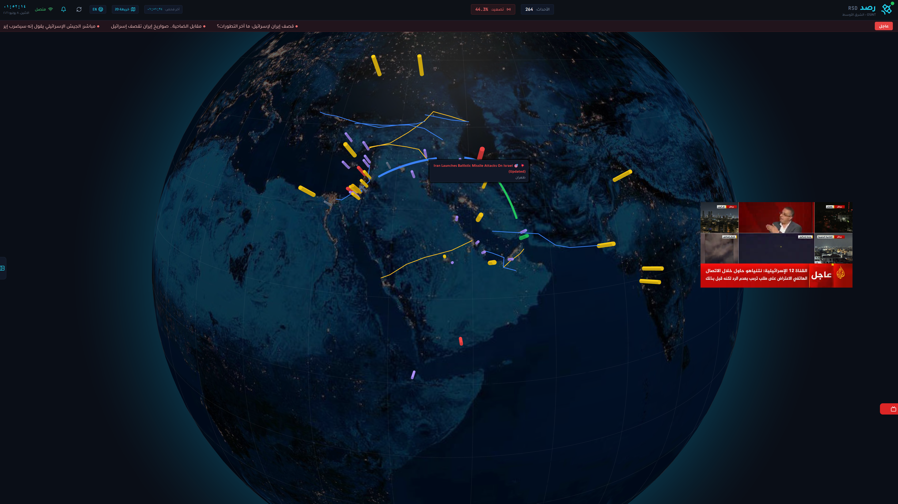

<div align="center">

# 🛰️ رصد (Rsd) v1.5

### منصة استخبارات المصادر المفتوحة للشرق الأوسط
**Open Source Intelligence (OSINT) Dashboard for the Middle East**


<br>


</div>

---

## 📋 نظرة عامة | Overview

**رصد** لوحة تحكم شخصية لرصد الأحداث العسكرية والأمنية والجيوسياسية في الشرق الأوسط لحظياً. تجمع البيانات من مصادر متعددة وتعرضها على خريطة تفاعلية (2D و 3D) مع تصنيف ذكي وتنبيهات صوتية.

**Rsd** is a personal OSINT dashboard for real-time monitoring of military, security, and geopolitical events across the Middle East. It aggregates data from multiple sources and displays them on an interactive 2D/3D map with intelligent classification and audio alerts.

<div align="center">

| الواجهة الرئيسية | الخريطة والأحداث |
|:---:|:---:|
|  |  |

</div>

---

## ⚡ التشغيل | Getting Started

استنسخ المشروع أولاً (للتحديث لاحقاً: `git pull origin main`):

```bash
git clone https://github.com/abosalehg-ui/rsd.git
cd rsd
```

ثم اختر إحدى الطرق التالية:

### 🖥️ الطريقة A — تطبيق سطح المكتب (ويندوز، الأسهل للمستخدم النهائي)

نزّل وثبّت `Rasad-Setup-x64.exe` — تطبيق مستقل لا يحتاج Python أو Node. بعد التثبيت يعمل كل شيء من `http://127.0.0.1:8000` ويفتح المتصفح تلقائياً.

> لبناء المثبّت بنفسك: راجع **[`packaging/README.md`](packaging/README.md)** ثم شغّل `packaging\build_installer.bat`.

> أولاً انسخ ملف المتغيّرات البيئية واملأ مفاتيحك (كلها اختيارية):
> ```bash
> cp .env.example .env
> ```
> راجع التعليقات داخل `.env.example` لمعرفة مصدر كل مفتاح.

### 🐳 الطريقة B — Docker

**تطوير** (خوادم dev + HMR):
```bash
docker compose up -d
# الواجهة:  http://localhost:3000   •   API Docs: http://localhost:8000/docs
```

**إنتاج** (واجهة مبنية عبر nginx + خلفية بلا reload):
```bash
docker compose -f docker-compose.prod.yml up -d --build
# الواجهة:  http://localhost:3000  (nginx يوكّل /api إلى الخلفية)
```

### 🧑‍💻 الطريقة C — تشغيل محلي للتطوير

```bash
# نافذة طرفية 1 — Backend
cd backend
pip install -r requirements.txt
uvicorn app.main:app --reload --port 8000

# نافذة طرفية 2 — Frontend
cd frontend
npm install
npm run dev
```

افتح <http://localhost:3000>.

> للمساهمة وتشغيل الفحوص: راجع **[`CONTRIBUTING.md`](CONTRIBUTING.md)**.

> 💡 على ويندوز يمكنك بدل ذلك النقر على `start-rasad.bat` لتشغيل Backend + Frontend معاً.

### 📋 المتطلّبات | Requirements

- **Python** 3.10+ و **Node.js** 18+ (للتطوير/البناء)
- **مفتاح NewsAPI** (اختياري) — [احصل على مفتاح مجاني](https://newsapi.org/)
- لبناء المثبّت: **Inno Setup 6** ([تنزيل](https://jrsoftware.org/isdl.php))

---

## ✨ الميزات | Features

| الميزة | الوصف |
|--------|-------|
| 🗺️ **خريطة 2D تفاعلية** | Leaflet مع تجميع ذكي للعلامات و6 طبقات (أحداث + طيران + إيران + نووي + قواعد + أنابيب) |
| 🌍 **كرة أرضية 3D** | globe.gl + Three.js — نقاط متوهّجة + **حلقات رادار متحرّكة** للأحداث العاجلة + arcs للضربات (تحميل كسول) |
| 📰 **شريط أخبار عاجلة** | تدفق مباشر مع فلاتر حسب التصنيف والخطورة والدولة |
| ✈️ **تتبع الطيران** | رصد الطائرات عبر ADS-B مع تمييز الطيران العسكري |
| ⏳ **خط زمني + 📊 إحصائيات** | عرض زمني للأحداث + مؤشر تصعيد وتوزيعات |
| 📺 **البث المباشر** | مشغّل مدمج للقنوات (الجزيرة، العربية، BBC) عبر `youtube-nocookie` |
| 🔔 **تنبيهات صوتية** | صوت تنبيه **جرسي راقٍ** (Web Audio API، يعمل offline) مع عتبة خطورة وتصنيفات قابلة للتخصيص |
| 🇮🇷 **متابعة إيران OSINT** | طبقة لرصد الضربات/الإطلاقات/التحركات مع تصنيف الثقة + متابعة 10 قياديين |
| ☢️ **منشآت نووية** | 24+ منشأة (مفاعلات/تخصيب/أبحاث) مع تفاصيل وسعة |
| ⚔️ **قواعد عسكرية + 🛢️ أنابيب** | 19 قاعدة رئيسية + 10 خطوط نفط/غاز |
| 📊 **مؤشر استخبارات الدول** | تقييم 0-100 لكل دولة بناءً على عدد ونوع الأحداث |
| 🌐 **ثنائي اللغة** | عربي/إنجليزي كامل مع تبديل RTL/LTR |
| 🖥️ **تطبيق سطح المكتب** *(جديد v1.5)* | مثبّت ويندوز كامل (PyInstaller + Inno Setup) — exe واحد يقدّم الـ API والواجهة معاً |
| 📦 **PWA** | يعمل دون اتصال — تخزين مؤقت للبلاطات وقوام الكرة + Service Worker |
| 💾 **ETag caching** | استجابات 304 Not Modified + Cache-Control حسب المسار |
| 🧪 **اختبارات + CI** | pytest (backend) + vitest (frontend) عبر GitHub Actions عند كل PR |

---

## 🖥️ تطبيق سطح المكتب *(جديد في v1.5)*

يمكن تغليف رصد كتطبيق ويندوز يُثبَّت بنقرة واحدة، دون حاجة لتثبيت Python أو Node لدى المستخدم.

**الفكرة:** الـ Backend (FastAPI) يقدّم الواجهة المبنية أيضاً، فيصبح كل شيء في **ملف `.exe` واحد** على `http://127.0.0.1:8000`. يجمّع **PyInstaller** الخادم + البيانات + الواجهة، ثم يلفّه **Inno Setup** في مثبّت مع اختصارات وأيقونة وأداة إزالة.

```bat
:: من جذر المستودع (يتطلّب Inno Setup 6 في PATH)
packaging\build_installer.bat
:: الناتج: packaging\Output\Rasad-Setup-x64.exe
```

- 📂 بعد التثبيت تُحفظ قاعدة البيانات والمفاتيح في `%LOCALAPPDATA%\Rasad\` (قابل للكتابة).
- 🎨 الأيقونة (طابع رادار) تُولَّد عبر `packaging/make_icon.py` وتُربط في الـ exe والمثبّت والاختصارات وأيقونة المتصفح.
- 📖 التفاصيل الكاملة (التخصيص، الأيقونة، التوقيع، SmartScreen) في **[`packaging/README.md`](packaging/README.md)**.

---

## ☢️ المنشآت النووية

طبقة على الخريطة تعرض **24+ منشأة نووية** في المنطقة، مبنية من بيانات IAEA PRIS العامة:

- **محطات قوة**: بوشهر، براكة، آكويو، الضبعة، تارابور، شاشمة، روستوف …
- **مراكز تخصيب**: نطنز، فوردو
- **مفاعلات أبحاث**: طهران، سوريك، المركز الأردني JRTR
- **معامل تحويل وماء ثقيل**: أصفهان، آراك
- **مواقع حساسة**: ديمونا (إسرائيل)، زابوريجيا (تحت الاحتلال)

كل علامة تعرض: الاسم بالعربي والإنجليزي، نوع المفاعل، السعة (MW)، الحالة، المُشغّل، تاريخ بدء التشغيل. يمكن إخفاء/إظهار الطبقة من لوحة "طبقات" أسفل الخريطة.

> 🔄 لإضافة منشأة جديدة: حرّر `backend/app/data/nuclear_facilities.json`.

---

## 🔔 التنبيهات الصوتية

نظام تنبيه مدمج يُنبّهك صوتيًا عند ورود أخبار مهمة دون متابعة الشاشة باستمرار.

- **صوت تنبيه جرسي راقٍ** يُولَّد عبر Web Audio API (نغمات `sine`/`triangle` تصاعدية، بلا ملفات خارجية، يعمل offline)
- **عتبة خطورة قابلة للتخصيص**: منخفض / متوسط / مرتفع / حرج
- **تصفية بالتصنيفات**: عسكري، نووي، دبلوماسي، إنساني، اقتصادي
- **فاصل تكرار قابل للضبط** (5-120 ثانية) لتفادي الإزعاج
- **إشعارات سطح المكتب اختيارية** (Notification API)
- **سجل آخر 5 تنبيهات** قابل للضغط للانتقال للحدث

افتح إعدادات التنبيهات من أيقونة 🔔 في الشريط العلوي (زر اختبار الصوت بالداخل).

---

## 🇮🇷 متابعة إيران OSINT

ميزة مستوحاة من [iranstrikemap.com](https://iranstrikemap.com) و [live-iran-map.com](https://live-iran-map.com) تضيف طبقة متخصصة لمتابعة الأحداث الإيرانية.

### نظام تصنيف الثقة

| المستوى | الرمز | المعنى | أمثلة المصادر |
|---------|-------|--------|--------------|
| **HIGH** | 🟢 | موثوق - مصادر OSINT متخصصة | ISW, Calibre Obscura, The Drive War Zone |
| **MEDIUM** | 🟡 | متوسط - صحافة دفاعية | Breaking Defense, Defense One, Iran International |
| **LOW** | 🔵 | غير مؤكد - أخبار عامة | Reuters, BBC |

### أنواع الأحداث المرصودة

| النوع | الأيقونة | الوصف |
|-------|----------|-------|
| **strike** | 💥 | ضربات جوية وهجمات |
| **launch** | 🚀 | إطلاقات صاروخية واختبارات |
| **movement** | 🪖 | تحركات عسكرية ومناورات |
| **nuclear** | ☢️ | أحداث نووية وتخصيب |
| **diplomatic** | 🤝 | مفاوضات وعقوبات |

### متابعة القادة الإيرانيين

يتابع النظام آخر أخبار **10 قياديين إيرانيين** تلقائياً:

| القائد | المنصب | | القائد | المنصب |
|--------|--------|---|--------|--------|
| علي خامنئي | المرشد الأعلى | | عباس عراقچي | وزير الخارجية |
| مسعود بزشكيان | الرئيس | | إسماعيل قاآني | قائد قوة القدس |
| حسين سلامي | قائد الحرس الثوري | | محمد إسلامي | رئيس منظمة الطاقة الذرية |
| محمد باقري | رئيس الأركان | | عزيز نصيرزاده | قائد سلاح الجو |
| أمير علي حاجي زاده | قائد الفضاء IRGC | | علي شمخاني | مستشار المرشد |

<details>
<summary>📚 مصادر Iran OSINT (اضغط للعرض)</summary>

**HIGH:** ISW · Calibre Obscura · The Drive (War Zone) · OSINTdefender
**MEDIUM:** Breaking Defense · Defense One · Al-Monitor · Iran International
**LOW:** Reuters (Middle East) · BBC (Middle East)

</details>

---

## 🏷️ التصنيفات | Categories

| التصنيف | الأيقونة | الوصف |
|---------|----------|-------|
| عسكري | 💥 | هجمات، غارات، عمليات عسكرية |
| دبلوماسي | 🤝 | مفاوضات، هدنات، قمم |
| إنساني | 🆘 | أزمات، لاجئين، مساعدات |
| نووي | ☣️ | تخصيب، وكالة الطاقة الذرية |
| اقتصادي | 📊 | عقوبات، نفط، تجارة |
| عام | 📰 | أخبار عامة |

---

## 📡 مصادر البيانات | Data Sources

| المصدر | الوصف | التحديث |
|--------|-------|---------|
| **GDELT** | أحداث عالمية من تحليل الأخبار | كل 15 دقيقة |
| **NewsAPI** | أخبار من مصادر عالمية متعددة | كل 10 دقائق |
| **RSS Feeds** | خلاصات عربية ودولية (25+ مصدر) | كل دقيقتين |
| **Google Alerts** | تنبيهات مخصصة للمنطقة | كل دقيقتين |
| **UCDP** | بيانات النزاعات المسلحة (جامعة أوبسالا) | يومياً |
| **ADS-B** | تتبع الطيران (adsb.lol) | كل 30 ثانية |
| **Iran OSINT** | مصادر OSINT متخصصة بإيران والشرق الأوسط | كل 30 دقيقة |

<details>
<summary>📰 مصادر RSS المدعومة (اضغط للعرض)</summary>

**أخبار عربية:** الجزيرة (عربي + English) · العربية · BBC Arabic/Middle East · France24 Arabic · Sky News Arabia · RT Arabic
**تحليلات دولية:** Al-Monitor · Defense One · War on the Rocks · The Drive (War Zone) · Breaking Defense
**أخبار نووية:** World Nuclear News · IAEA News · Arms Control Association
**Google Alerts:** Middle East Airstrikes · Gaza/Yemen/Syria · Houthi/حوثي · Red Sea · Iran Nuclear/تخصيب يورانيوم · Ceasefire/هدنة · Humanitarian Crisis

</details>

---

## 📁 هيكل المشروع | Project Structure

```
rsd/
├── 📂 backend/
│   ├── 📂 app/
│   │   ├── 📄 main.py              # نقطة الدخول + API (+ تخديم الواجهة في وضع سطح المكتب)
│   │   ├── 📄 config.py            # الإعدادات (.env) + مسارات قابلة للكتابة عند التجميد
│   │   ├── 📄 scheduler.py         # جدولة جمع البيانات (APScheduler)
│   │   ├── 📂 collectors/          # gdelt · news_api · rss_feeds · ucdp · adsb · iran_osint
│   │   ├── 📂 api/                 # events (+country-index) · flights · iran · nuclear · infrastructure
│   │   ├── 📂 data/                # nuclear_facilities · military_bases · pipelines (JSON)
│   │   ├── 📂 middleware/          # cache.py (ETag + Cache-Control)
│   │   └── 📂 models/database.py   # SQLite + SQLAlchemy
│   ├── 📄 run_desktop.py           # 🖥️ نقطة دخول تطبيق سطح المكتب (v1.5)
│   └── 📄 requirements.txt
│
├── 📂 frontend/
│   ├── 📂 src/
│   │   ├── 📄 App.jsx
│   │   ├── 📂 components/
│   │   │   ├── 📂 Layout/          # Header · LiveTVDrawer · AlertSettings
│   │   │   ├── 📂 Map/             # RasadMap.jsx (2D) · RasadGlobe.jsx (3D، lazy)
│   │   │   ├── 📂 NewsFeed/        # NewsFeed.jsx
│   │   │   ├── 📂 Timeline/        # Timeline.jsx
│   │   │   ├── 📂 Stats/           # StatsPanel.jsx · CountryIndex.jsx
│   │   │   └── 📂 Iran/            # IranPanel.jsx
│   │   ├── 📂 hooks/               # usePolling.js · useAudioAlert.js
│   │   ├── 📂 i18n/                # index.js + locales/{ar,en}.json
│   │   └── 📂 utils/               # api.js · constants.js
│   ├── 📂 public/                  # favicon.ico + أيقونات PWA
│   ├── 📂 src-tauri/               # scaffolding Tauri (بديل تجريبي لسطح المكتب)
│   └── 📄 vite.config.js · index.html · package.json
│
├── 📂 packaging/                   # 🖥️ بناء مثبّت ويندوز (v1.5)
│   ├── 📄 build_installer.bat      # بناء كامل بأمر واحد
│   ├── 📄 rasad.spec               # مواصفات PyInstaller (onedir)
│   ├── 📄 rasad.iss                # سكربت Inno Setup
│   ├── 📄 make_icon.py             # مولّد الأيقونة (Pillow)
│   ├── 🖼️ rasad.ico                # الأيقونة الجاهزة
│   └── 📄 README.md                # دليل البناء
│
├── 📂 .github/workflows/           # ci.yml (lint+tests+build) · deploy-frontend.yml
├── 📄 docker-compose.yml
├── 📄 start-rasad.bat / stop-rasad.bat   # تشغيل/إيقاف سريع (Windows، وضع التطوير)
└── 📄 README.md
```

---

## ⚙️ API Endpoints

<details open>
<summary><b>الأحداث | Events</b></summary>

| المسار | الوصف |
|--------|-------|
| `GET /api/events/` | الأحداث مع فلاتر (category, severity, country_code, hours, limit) |
| `GET /api/events/latest` | أحدث 20 حدث |
| `GET /api/events/map` | أحداث الخريطة (التي لها إحداثيات) |
| `GET /api/events/stats` | إحصائيات شاملة |
| `GET /api/events/timeline` | بيانات الخط الزمني |
| `GET /api/events/country-index?hours=72&top=20` | ترتيب الدول حسب درجة 0-100 |

</details>

<details>
<summary><b>الطيران · إيران · النووي · البنية التحتية · النظام</b></summary>

**الطيران | Flights**
| المسار | الوصف |
|--------|-------|
| `GET /api/flights/live` | الرحلات الحية الآن |
| `GET /api/flights/military/history` | سجل الطيران العسكري |
| `GET /api/flights/military/stats` | إحصائيات الطيران |

**إيران OSINT**
| المسار | الوصف |
|--------|-------|
| `GET /api/iran/strikes` | الضربات (confidence, event_type, hours) |
| `GET /api/iran/leaders` | القادة الإيرانيون مع آخر أخبارهم |
| `GET /api/iran/stats` | إحصائيات حسب النوع والثقة |

**المنشآت النووية ☢️**
| المسار | الوصف |
|--------|-------|
| `GET /api/nuclear/facilities` | قائمة المنشآت (country, facility_type, status) |
| `GET /api/nuclear/facilities/{id}` | تفاصيل منشأة |
| `GET /api/nuclear/stats` | إحصائيات حسب الدولة/النوع/الحالة |

**البنية التحتية ⚔️ 🛢️**
| المسار | الوصف |
|--------|-------|
| `GET /api/infrastructure/bases` | قواعد عسكرية (country, operator, base_type) |
| `GET /api/infrastructure/pipelines` | خطوط أنابيب (pipeline_type, status) |

**النظام | System**
| المسار | الوصف |
|--------|-------|
| `GET /api/health` | فحص صحة النظام |
| `GET /api/sources` | المصادر المتاحة |
| `GET /api/collectors/status` | حالة جامعي البيانات |
| `POST /api/refresh` | تحديث يدوي من جميع المصادر |

</details>

> 📚 توثيق تفاعلي كامل عبر Swagger على `http://localhost:8000/docs`.

---

## 🔧 الإعدادات | Configuration

أنشئ ملف `.env` في المجلد الرئيسي (أو في `%LOCALAPPDATA%\Rasad\.env` لتطبيق سطح المكتب):

```env
# مفاتيح API (اختيارية)
NEWSAPI_KEY=your_newsapi_key_here

# قاعدة البيانات (الافتراضي: ملف محلي ./rasad.db ؛ تطبيق سطح المكتب يستخدم %LOCALAPPDATA%\Rasad)
DATABASE_URL=sqlite+aiosqlite:///./rasad.db

# فترات التحديث (بالثواني)
GDELT_INTERVAL=900        # 15 دقيقة
NEWSAPI_INTERVAL=600      # 10 دقائق
RSS_INTERVAL=120          # دقيقتان
UCDP_INTERVAL=86400       # يوم
ADSB_INTERVAL=30          # 30 ثانية

# الخادم
BACKEND_HOST=0.0.0.0
BACKEND_PORT=8000
```

---

## 🛠️ التقنيات | Tech Stack

| الطبقة | التقنيات |
|--------|----------|
| **Backend** | FastAPI · SQLAlchemy · aiosqlite · APScheduler · httpx · feedparser |
| **Frontend** | React 18 · Vite · Tailwind CSS · react-i18next (RTL) · Recharts · Lucide |
| **الخرائط** | Leaflet (2D، 6 طبقات) · globe.gl + Three.js (3D: نقاط + حلقات رادار + arcs) |
| **الصوت/PWA** | Web Audio API (توليد التنبيه) · vite-plugin-pwa + Workbox |
| **التغليف** | PyInstaller + Inno Setup (مثبّت ويندوز) · Pillow (الأيقونة) |
| **الجودة** | pytest · vitest · ruff · GitHub Actions CI |

---

## 🗄️ قاعدة البيانات | Database Schema

| الجدول | الوصف |
|--------|-------|
| `events` | جميع الأحداث من كل المصادر (+ حقلا confidence و video_url) |
| `flight_tracks` | سجل تتبع الطيران |
| `iranian_leader_news` | أخبار القادة الإيرانيين المرصودة |

---

## 🌐 النشر | Deployment

### 🖥️ تطبيق سطح المكتب (Windows)
ابنِ مثبّتاً مستقلاً عبر `packaging\build_installer.bat` (راجع [`packaging/README.md`](packaging/README.md)). الأنسب للاستخدام الشخصي بلا اعتماديات.

### 🐳 Docker (محلي أو VPS)
```bash
docker compose up -d --build
```
ينشر الـ Backend على `8000` والواجهة على `3000`.

### 📄 GitHub Pages (الواجهة فقط)
workflow جاهز في `.github/workflows/deploy-frontend.yml` يبني الواجهة وينشرها عند كل push إلى `main`.

1. **Settings → Pages** → اختر *Source: GitHub Actions*
2. (اختياري) أضف Secret باسم `VITE_API_BASE` يشير لـ Backend خارجي، مثل: `https://api.example.com/api`
3. ادفع تعديلات على `frontend/**` — يبدأ النشر تلقائياً

> ⚠️ **قيد مهم:** الـ Backend (FastAPI + SQLite + APScheduler) **لا يعمل على GitHub Pages** (ملفات ثابتة فقط). لنسخة عامة كاملة استضف الباك على Railway / Render / Fly.io واضبط `VITE_API_BASE`، أو شغّل المشروع محلياً.

---

## 🤝 المساهمة | Contributing

```bash
git checkout -b feat/my-feature
# عدّل، اختبر (pytest / npm test)، ثم:
git commit -m "feat: وصف التغيير"
git push origin feat/my-feature   # ثم افتح Pull Request
```

أنماط رسائل الـ commit: `feat:` · `fix:` · `docs:` · `refactor:` · `style:` · `test:` · `chore:`.

---

## 🗺️ خارطة الطريق | Roadmap

<details>
<summary>✅ الإصدارات السابقة (v1.1 → v1.4)</summary>

- **v1.1** — طبقة إيران OSINT + تصنيف الثقة + متابعة القادة
- **v1.2** — المنشآت النووية + التنبيهات الصوتية + نشر GitHub Pages
- **v1.3** — كرة 3D + i18n عربي/إنجليزي + مؤشر استخبارات الدول + قواعد/أنابيب
- **v1.4** — اختبارات (pytest + vitest) + CI + ETag caching + PWA + Tauri scaffold

</details>

### ✅ v1.5 — تطبيق سطح المكتب وتحسينات (الحالي)
- [x] 🖥️ مثبّت ويندوز كامل (PyInstaller + Inno Setup) — exe واحد يقدّم الـ API والواجهة
- [x] 🎨 أيقونة تطبيق (طابع رادار) + favicon
- [x] 🖼️ تحسين عرض 3D — نقاط متوهّجة + حلقات رادار للأحداث العاجلة (بدل الأعمدة)
- [x] 🔔 صوت تنبيه جرسي محسّن (بدل الموجة المربّعة القاسية)
- [x] 🐛 إصلاحات: ظهور اللوحة الجانبية في وضع 3D · تنظيف `docker-compose` · `youtube-nocookie`

### 🔮 v2.0 — ذكاء وتحليل
- [ ] 🤖 **Ollama/Qwen AI** — تصنيف وتلخيص ذكي للأخبار العربية
- [ ] 🧠 **تحليل المشاعر** والكيانات (NER)
- [ ] 📡 **Telegram** + **Twitter/X** كمصادر إضافية
- [ ] 🎯 **Signal Convergence** — اكتشاف تقارب الإشارات تلقائياً
- [ ] 📄 **تقارير PDF** تلقائية
- [ ] 📍 تحديد موقع جغرافي دقيق (بدل مراكز الدول)

> 💡 خارطة الطريق مستوحاة جزئياً من المشروع المفتوح [worldmonitor](https://github.com/koala73/worldmonitor) كمصدر أفكار معمارية (مع الالتزام بترخيص رصد MIT).

---

## 🐛 استكشاف الأخطاء | Troubleshooting

| المشكلة | الحل |
|---------|------|
| **لا تظهر أخبار جديدة** | تأكد من تشغيل Backend (`/api/health`)، افحص `/api/collectors/status`، ثم اضغط 🔄 |
| **طبقة إيران OSINT فارغة** | تظهر بعد أول دورة جمع — انتظر دقيقة بعد التشغيل واضغط 🔄 (`/api/iran/strikes`) |
| **خطأ NewsAPI** | أضف `NEWSAPI_KEY` في `.env` (المفتاح المجاني يعطي أخباراً قديمة 24+ ساعة) |
| **الخريطة 2D لا تعمل** | تحقق من الإنترنت (Leaflet يحتاج tiles من CartoCDN) وافحص Console |
| **🖥️ المثبّت: تحذير SmartScreen/مكافح فيروسات** | طبيعي لتطبيق غير موقّع — اختر "Run anyway" (للتوقيع: شهادة Code Signing) |
| **🖥️ المنفذ 8000 مشغول** | أغلق أي نسخة عاملة (أو خادم تطوير) — التطبيق يكتفي بفتح المتصفح على النسخة العاملة |
| **🖥️ لا يُعثر على ISCC أثناء البناء** | ثبّت Inno Setup 6 وأضف مجلّده إلى PATH (أو افتح `rasad.iss` يدوياً واضغط Compile) |

---

## 📝 الترخيص | License

هذا المشروع للاستخدام الشخصي والتعليمي (MIT).

---

<div align="center">

**رصد** 🛰️ — صُنع بـ ❤️ للمعرفة والتوثيق
**Rsd** — Made with ❤️ for Knowledge and Documentation

---

المطور | Developer: **عبدالكريم العبود**

📧 abo.saleh.g@gmail.com


</div>
